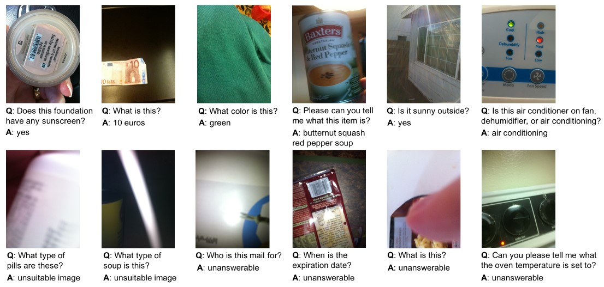
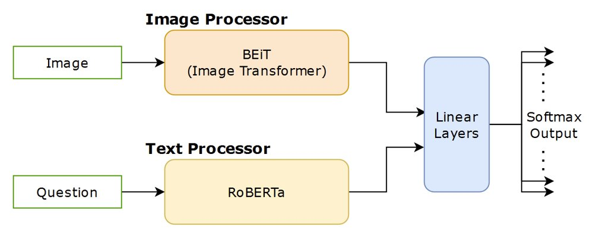
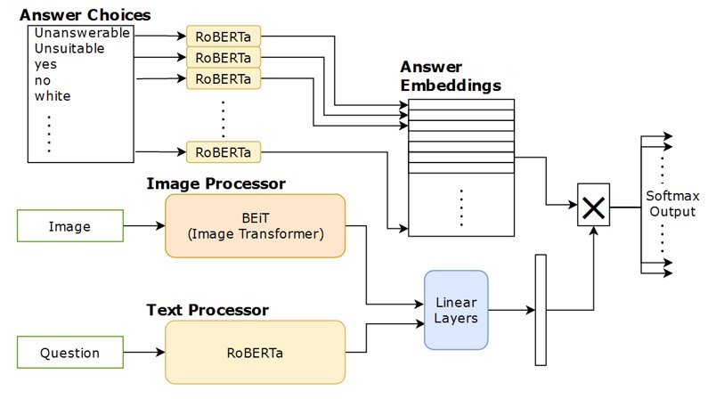
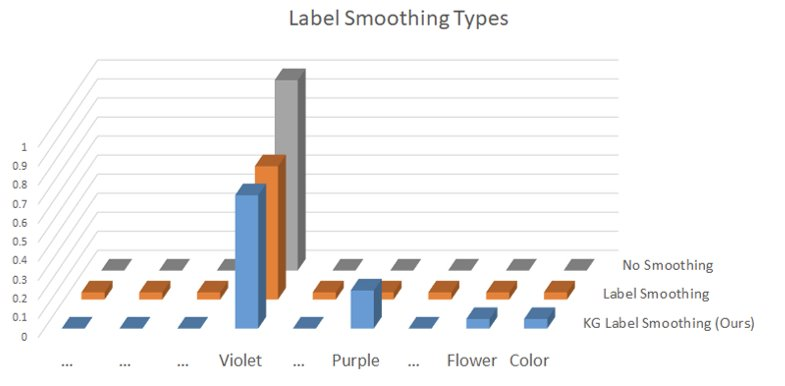
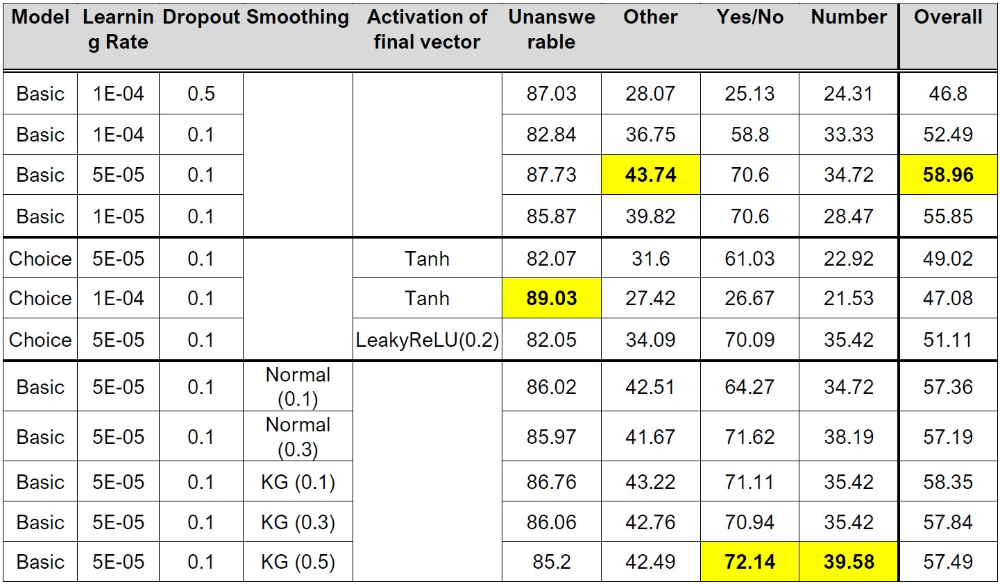
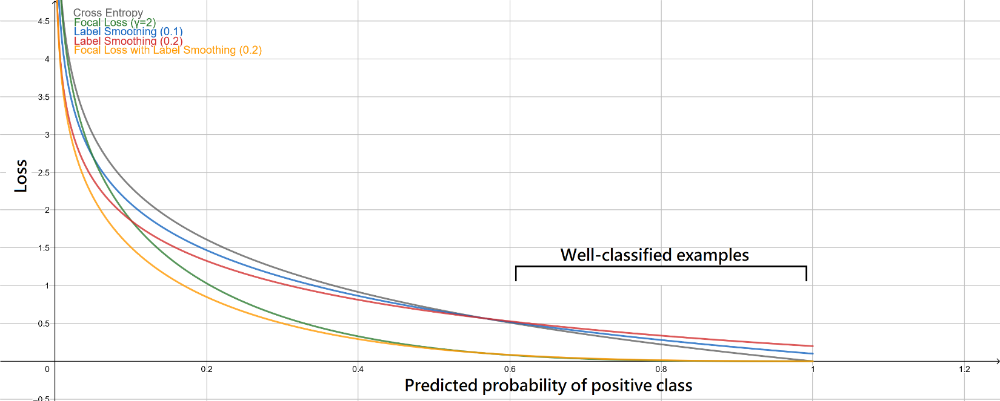
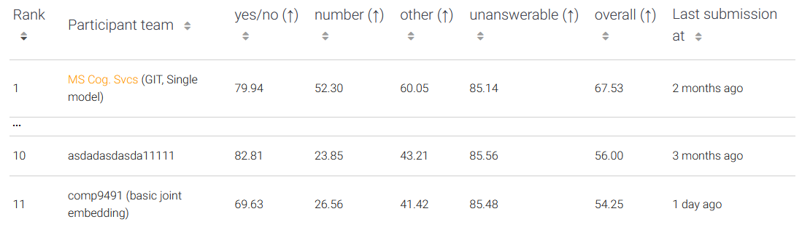

<!-- Improved compatibility of back to top link: See: https://github.com/othneildrew/Best-README-Template/pull/73 -->

<!-- PROJECT LOGO -->
 

  <h3 align="center">VizWiz VQA</h3>

  

    Joint Embedding with Transformers
  

<!-- ABOUT THE PROJECT -->
## Overview & Files

This is a part of the group project of the course COMP9491 Applied AI at UNSW. Only the work done by me is included in this repository.

All of the code files in this directory were ran in Kaggle. The code is based on the article written by Tezan Sahu [https://medium.com/data-science-at-microsoft/visual-question-answering-with-multimodal-transformers-d4f57950c867] and further modified to perform our experiments.

There is 1 file included in this folder:
* `vizwiz-vqa-example.ipynb`
 

### vizwiz-vqa-example.ipynb

This file contains the kaggle notebook about joint embedding with transformers basic model, choice embedding model, and label smoothing functionality with focal loss. 
https://www.kaggle.com/code/lhanhsin/vizwiz-vqa-example

 

## Usage

To be able to run these files locally, you'll need to download all the [VizWiz Dataset files](https://vizwiz.org/tasks-and-datasets/vqa/). For each file you will need to adjust the input paths manually to find the `train.json`, `val.json` and the `train/` images from the original VizWiz dataset. Please note that the answer embeddings through RoBERTa for the choice embedding model must be generated manually first; the details are described in the notebook.

---
 

  <h3 align="center">Report</h3>

## Introduction
The Visual Question Answering (VQA) problem is a task that requires the model to answer a question given a relating image.
The description of the [Vizwiz dataset](https://vizwiz.org/tasks-and-datasets/vqa/) from the official website is as follow:  
>*We propose an artificial intelligence challenge to design algorithms that answer visual questions asked by people who are blind. For this purpose, we introduce the visual question answering (VQA) dataset coming from this population, which we call VizWiz-VQA.  It originates from a natural visual question answering setting where blind people each took an image and recorded a spoken question about it, together with 10 crowdsourced answers per visual question. Our proposed challenge addresses the following two tasks for this dataset: predict the answer to a visual question and (2) predict whether a visual question cannot be answered.*

> *Figure 1: Examples of visual questions asked by blind people and corresponding answers agreed upon by crowd workers. The examples include questions that both can be answered from the image (top row) and cannot be answered from the image (bottom row).*

## Methods

  
  

> *Figure 2: Model structure of the basic model (left) and the choice embedding model (right).*

***Basic Model*** Given the success of large pretrained transformer models, we built our basic model based on the joint embedding of BEiT and RoBERTa. The pretrained models processed the image and question separately and created a joint embedding by concatenating the pooling layers. The joint embedding was further passed into multiple dense layers generating a softmax distribution over possible responses as final output.
 
VQA datasets are often imbalanced and noisy because it is natural to have multiple answers for a single image/question pair. Although there exist datasets that have a carefully designed data collection process and data post-processing procedures, we aimed to solve datasets that were more similar to real life scenarios. Therefore, we used focal loss which was designed to counter imbalanced datasets and is known to have the ability to deal with noisy datasets.

***Choice Embedding*** Normally the classifier model knows nothing about the output choices and only learns how the information is mapped to the output space through training samples. This is not ideal in our task since training data is sparse and it would be beneficial if we adopt few-shot learning mechanism, allowing the model to benefit from the underlying pattern of natural language. We achieved this by mapping each output answer to an embedding space which was generated by inputting the words into RoBERTa so the model learned to classify while considering the answer embeddings as illustrated in Figure 2.

> *Figure 3: An illustration of hard labels (top), uniform label smoothing (middle), and knowledge graph label smoothing (bottom).*

***Knowledge Graph Soft Labels*** Soft labels such as label smoothing is a common technique used to regularize and prevent the model from being overconfident in classification tasks, and sometimes mitigated the impact of noisy data. Label smoothing worked fine, however, soft labelling could be even more beneficial by capturing extra information into the labels, especially for VQA tasks where the majority of image/question pairs have multiple correct or related answers. To discover the underlying relations between answers and assign them to the labels, we propose a simple method to distribute the target weights only among related answers. The related answers of a target answer were determined by querying the top 100 similar entities in the Google Knowledge Graph and a portion of target weights were distributed across them according to the word frequency. An example of expected label distribution is illustrated in Figure 3.

***Training and Hyperparameters*** We treated the VizWiz VQA task as a multiple-choice problem with a predefined answer space of the 3000 most frequent words. 96.6% of the training data and 96.7% of the validation data has at least one answer in the answer space, making the max accuracy achievable on the validation set 88.13%. We saw this as an acceptable trade off since increasing the answer space without additional data could make it more difficult for the model to learn and converge. The hyperparameters were initially manually tuned by observing the first 10 epochs of training metrics. The initialization method of the classifier weights and biases were respectively the Kaiming normal and normal distribution with standard deviation of 0.03. The focal loss has gamma set to 2 and alpha is defined as: 𝛼_𝑙𝑎𝑏𝑒𝑙=1/log(𝑙𝑎𝑏𝑒𝑙 𝑓𝑟𝑒𝑞𝑢𝑒𝑛𝑐𝑦+10)  
The alpha was further shifted to a mean of 1 to ensure that the magnitude of loss did not change with the size of the dataset. Grid search was then performed on a smaller set of parameters with 20 epochs.

## Results & Discussion

>*Table 1: All results from variations of the joint embeddings with transformers. All models are trained for 20 epochs on the VizWiz training set and evaluated on the validation set.*

>*Figure 4: Plot of different types of loss functions. Label smoothing aims to regularize the model from being over-confident and the effect can be seen in the well-classified examples region where the gradient is reduced compared to cross-entropy. Focal loss has the same effect in the well-classified region and has approximately the same gradient as label smoothing (0.2). Combining focal loss with label smoothing creates a loss function that is strongly regularizing.*

>*Figure 5: Screenshot from the official [2022 VizWiz Challenge](https://eval.ai/web/challenges/challenge-page/1560). Our basic model is at 11th place as of 8/8/2022.*

***Overall Performance*** Out of all three variations, the basic model performs the best. This is expected as most hyperparameter effort is spent on the basic model whereas we only performed a shallow search for the other models based on the hyperparameters of the basic model.

***Choice Embedding*** The choice embedding model performed worse and this is because of insufficient hyperparameter tuning and lack of expressivity of the model. This model is trained with a constraint to align with the RoBERTa embedding space and a single vector is unlikely to have enough capacity to capture all the features when multiplying with the answer embedding space. A possible solution to this issue is to refer to how attention solves this, which is by using multi-head vectors. One of the configurations produced the highest score in the unanswerable category but is evident that it traded the accuracy of yes/no categories by guessing more unanswerable and unsuitable which is not ideal.

***Soft Labels with Knowledge Graph*** All of the soft labels caused the model to perform slightly worse than without soft labels. This is caused by the modular component in the focal loss since it already has a similar effect as soft labelling as shown in Figure 16 and trying to add label smoothing on top over regularizes and produces noise. However, soft labels with knowledge graph produce better results compared to uniform label smoothing even when the smoothing factor is extremely large. This indicates that our method produces informative soft labels and generates less noise compared to uniform soft labelling; furthermore, encourages the model to explore more therefore having the highest accuracy in the yes/no and number category.
2022 VizWiz Challenge. After retraining the basic model on the training and validation set, we submit the predicted results on the test set to the online evaluation system. Our method is at 11th place as of 8/8/2022. We believe this is decent since we are restricted to smaller training datasets and lower GPU resources and can be easily improved by adding external VQA datasets and more hyperparameter tunning.

## Conclusion
For our work on joint embedding with transformers, we demonstrated a simple yet strong model to solve the VizWiz VQA task based on the power of pretrained models. We also attempted to bring further improvement by embedding the answer space information into the model, and proposed soft labelling based on knowledge graphs which prove to be better than uniform label smoothing. For future development, besides of increasing hyperparameter tuning range, we aim to increase the capacity of the models by using multi-head designs and avoid information loss over the pretrained models by creating skip connections from early layers to the end classifying layers. Soft labels are also worth researching to find a way to create labels that adapt through the learning process instead of fixed labels.